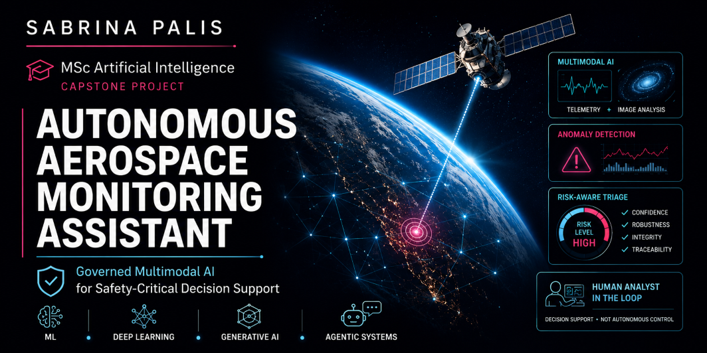
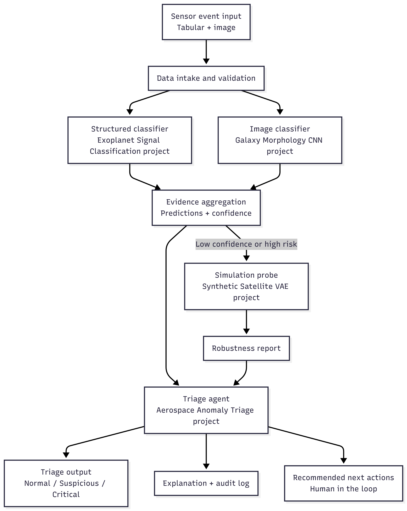

# Autonomous Aerospace Monitoring Assistant
## Integrative Industry AI System Design — Capstone Synthesis

<p align="center">

</p>

[](https://doi.org/10.5281/zenodo.20433541)


---

## Project Overview

This project presents an integrated AI decision-support architecture for anomaly triage in safety-critical aerospace environments.

Modern aerospace systems generate continuous streams of telemetry data and visual sensor inputs. These signals may reflect routine environmental variation, benign noise, or potentially critical system malfunctions. The operational challenge is not merely anomaly detection, but responsible triage under uncertainty.

This project designs a governed AI workflow that assists human analysts in evaluating anomalous events while preserving transparency, accountability, and bounded autonomy.

The system integrates machine learning, deep learning, generative robustness testing, and agentic decision logic into a coherent, auditable pipeline.

This artifact represents the culmination of cross-domain integration across the Udacity Master's in AI Capstone program.

---

## Why This Matters

Many AI systems focus exclusively on predictive performance.

In safety-critical environments, prediction alone is insufficient.

Operators must understand uncertainty, assess risk, inspect evidence, and maintain accountability for decisions.

This project explores how AI systems can be designed as governed decision-support infrastructure rather than autonomous decision-makers.

---

## Key Skills Demonstrated

- Python
- Machine Learning
- Deep Learning
- Generative AI
- Agentic AI Workflows
- Multimodal Systems
- Responsible AI
- AI Governance
- Risk-Aware Decision Systems
- Human-in-the-Loop Architecture
- Technical Documentation

---

## What This System Demonstrates

This project demonstrates:

* Multimodal AI integration (tabular telemetry + image perception)

* Evidence aggregation with calibrated confidence

* Conditional robustness probing via generative simulation

* Risk-aware routing and escalation logic

* Human-in-the-loop decision support

* Structured audit logging for traceability

* Explicit governance boundaries

* Evaluation of system-level behavior under uncertainty

The emphasis is on system design and responsible orchestration and not on isolated model performance.

---

## Integrated Capstone Domains

This system integrates four prior project domains:

### 1. Structured Machine Learning

From: [Exoplanet Signal Classification](https://github.com/MinervaRose/applied-machine-learning)

Contribution:

* Tabular classifier workflow

* Calibrated confidence scoring

* Structured feature reasoning

### 2. Deep Learning Perception

From: [Galaxy Morphology CNN](https://github.com/MinervaRose/deep-learning-systems)

Contribution:

* Image-based classification pipeline

* Multimodal corroboration logic

### 3. Generative AI

From: [Synthetic Satellite VAE](https://github.com/MinervaRose/generative-ai-applications)

Contribution:

* Robustness probing via plausible perturbations

* Instability detection under simulation

### 4. Agentic Workflow Design

From: [Aerospace Anomaly Triage](https://github.com/MinervaRose/design-of-agentic-workflows)

Contribution:

* Bounded decision logic

* Escalation pathways

* Safeguards and audit trace logging

The integration creates layered defense:

Detection → Multimodal corroboration → Robustness testing → Escalation logic

Instead of relying on a single model, the system becomes risk-aware and auditable.

---

## System Architecture

The workflow follows a modular pipeline:

Incoming Event
→ Structured Telemetry Classifier
→ Image Classifier
→ Evidence Aggregation
→ Conditional Robustness Probe
→ Triage Agent with Audit Log
→ Final Triage Category + Explanation

Key design properties:

* Modular architecture for inspectability

* Conditional routing based on uncertainty and risk

* Hard safety overrides for data integrity flags

* Human-in-the-loop enforcement

* Structured audit outputs

<p align="center">

</p>

---

## Evaluation Summary

The system is evaluated at the system level rather than via isolated accuracy metrics.

Observed behaviors include:

* Inverse relationship between confidence and operational risk

* Conditional activation of robustness probe under elevated uncertainty

* Escalation to Critical when instability or integrity issues are detected

* Balanced triage distribution across Normal, Suspicious, and Critical cases

* Evaluation demonstrates coherent routing behavior consistent with design intent.

---

## Ethical and Responsible AI Design

Ethical reasoning directly shaped architectural decisions.

The system explicitly addresses:

* Automation bias (confidence surfaced transparently)

* Accountability (structured audit logging)

* Transparency (intermediate outputs preserved)

* Safety (escalation under low confidence or instability)

* Bounded autonomy (recommendations only; no autonomous control)

* The system is designed as decision-support infrastructure, not an autonomous controller.

* Governance is embedded in architecture, not appended post hoc.

---

## Limitations

This prototype emphasizes orchestration rather than production-grade deployment.

Current limitations include:

* Simplified robustness perturbation logic

* Heuristic escalation thresholds

* Risk of dataset drift under operational shift

* Potential correlated model error

* Future production deployment would require:

* Real aerospace dataset training and validation

* Threshold calibration to mission-specific cost functions

* Drift monitoring infrastructure

* Physics-informed robustness testing

---

## How to Run

Install dependencies:

```
pip install -r requirements.txt
```

Open:

```
Integrative_Industry_Synthesis.ipynb
```

Run all cells sequentially.

The notebook executes top-to-bottom and reproduces:

* Multimodal classification

* Evidence aggregation

* Conditional robustness routing

* Triage categorization

* Structured audit outputs

* Evaluation plots

No hidden state is required.

---

## Repository Structure

📓 Integrative_Industry_Synthesis.ipynb

📄 Reflective_Synthesis.pdf

📄 Presentation.pdf

📄 requirements.txt

🖼 architecture_diagram.png

📘 README.md

---

## Research Orientation

This project explores governed AI orchestration under uncertainty in safety-critical environments.

The emphasis is not on autonomous decision-making, but on designing auditable, modular, and bounded AI systems capable of supporting human operators under conditions of incomplete information and operational ambiguity.

The repository serves as an exploratory systems synthesis artifact at the intersection of:
- multimodal AI
- uncertainty-aware routing
- human-AI collaboration
- responsible AI architecture
- operational triage systems

---
## Professional Relevance

This project demonstrates readiness for applied AI system design in safety-critical domains.

It showcases:

* Cross-paradigm integration (ML + DL + GenAI + agentic workflows)

* Risk-aware routing under uncertainty

* Governance-aware system architecture

* Ethical constraint implementation

* Structured technical communication

The core competency demonstrated is not building a single model, but designing a defensible AI decision-support system.

---
Developed by Sabrina Palis
MSc Artificial Intelligence

